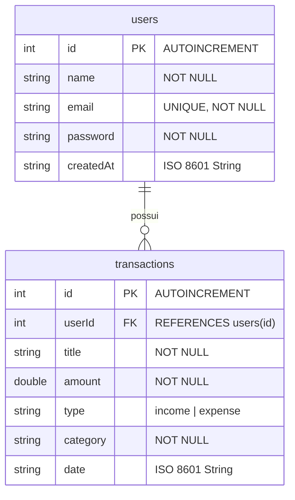

# 💰 Finanças OAT - Aplicativo de Controle Financeiro Pessoal

Bem-vindo ao **Finanças OAT**, um aplicativo moderno, premium e completo de finanças pessoais desenvolvido em **Flutter** seguindo práticas avançadas da arquitetura **MVVM (Model-View-ViewModel)**. 

O aplicativo apresenta um visual premium de alta fidelidade na cor verde-financeiro (estilo PicPay), com suporte a banco de dados persistente (SQLite), cotações de moedas em tempo real da AwesomeAPI, conversor de moedas integrado e gráficos de análise financeira rica e responsiva.

---

## 🎨 Design System & Visual Premium
O visual foi planejado para surpreender desde o primeiro contato, focando em elegância, usabilidade e feedback micro-animado:
* **Harmonia Cromática**: Baseada no verde PicPay (`#00C853`), com tons contrastantes de verde escuro, coral/vermelho suave para despesas e azul-turquesa para o saldo de carteira.
* **Tipografia Moderna**: Integrada à fonte premium **Inter** do Google Fonts para máxima legibilidade.
* **Componentização Premium**: Cards de resumo com cantos arredondados (16px), sombras suaves responsivas ao toque, formulários preenchidos dinamicamente e transição suave (AnimatedSwitcher) entre as telas de Login e Cadastro.

---

## 📐 Estrutura Arquitetural (MVVM)
O projeto foi estruturado com total separação de conceitos para garantir escalabilidade, testabilidade e organização impecável:

```
lib/
├── app.dart              # Instanciação do MaterialApp, aplicação do tema e roteamento principal
├── main.dart             # Inicializador do Flutter e injeção do ProviderScope do Riverpod
├── core/
│   ├── constants/        # AppStrings - Centraliza todas as strings da aplicação em PT-BR
│   └── validators/       # FormValidators - Validações robustas para formulários (senhas, e-mails, etc.)
├── data/
│   ├── local/            # AppDatabase - Gerenciador do banco de dados local SQLite (sqflite)
│   └── repositories/     # Repositórios que encapsulam as queries SQL de usuários e transações
├── models/               # Modelos de dados imutáveis puros (UserModel, TransactionModel, CurrencyModel)
├── theme/                # AppTheme - Definições completas do design system e tokens de estilo do Material 3
├── viewmodels/           # Gerenciamento de estado reativo por meio do flutter_riverpod (Flat Notifiers)
├── views/                # Telas (Views) do aplicativo integradas aos ViewModels
│   ├── auth/             # Login & Cadastro unificados em tela única com transição dinâmica
│   ├── shell/            # MainShell - Abas inferiores controladas por IndexedStack (Navegação sem perda de estado)
│   ├── dashboard/        # Tela inicial com visão de carteira, cartões de resumo, lista CRUD e BottomSheets
│   ├── analytics/        # Análise financeira rica contendo gráficos de barras e setores (pizza)
│   ├── currency/         # Cotações em tempo real e Conversor instantâneo de BRL para USD/EUR/BTC
│   └── profile/          # Gestão do perfil, avatar dinâmico por iniciais e estatísticas de uso
└── widgets/              # Componentes genéricos reutilizáveis (botões premium, campos customizados, cards)
```

---

## 💾 Modelagem de Dados & Banco de Dados (SQLite)

O aplicativo utiliza um banco de dados local SQLite contendo duas tabelas fortemente integradas por chaves estrangeiras (`FOREIGN KEY`), garantindo a integridade dos dados por usuário:



* **Repositório de Autenticação (`AuthRepository`)**: Lida com persistência segura, cadastro de novos usuários (impedindo duplicidade de e-mail com tratamentos de erros de banco) e validação de login.
* **Repositório de Transações (`TransactionRepository`)**: Lida com o ciclo completo de CRUD (criação, leitura, atualização e deleção) das receitas e despesas vinculadas ao usuário logado, além de filtros reativos por tipo de movimentação.

---

## ⚡ Fluxo de ViewModels (Riverpod State Management)

A reatividade e sincronização em tempo real entre a interface do usuário (UI) e o banco de dados é feita via **Riverpod (StateNotifier)**. Todas as regras de negócio são centralizadas na camada de ViewModels:

1. **`AuthViewModel`**: Mantém o estado global da sessão do usuário (`AuthState`). Realiza o login reativo, cria as contas no SQLite e expõe o usuário autenticado por meio da propriedade `user` para os demais componentes.
2. **`TransactionsViewModel`**: Gerencia o estado de transações do usuário atual (`TransactionsState`). Ao adicionar, editar ou remover uma movimentação, o banco de dados é atualizado e a lista é recarregada instantaneamente, propagando os dados para as demais views.
3. **`DashboardViewModel` (Estado Derivado)**: Consome a lista de transações e expõe de forma calculada e em tempo real o **Saldo Total**, a **Soma de Receitas**, a **Soma de Despesas** e as **5 transações mais recentes**.
4. **`AnalyticsViewModel` (Estado Derivado)**: Agrupa todas as despesas por categoria de forma assíncrona para abastecer os gráficos de Pizza e calcula as barras comparativas de Receita vs Despesa.
5. **`CurrencyViewModel`**: Integra-se com a API externa da **AwesomeAPI** (`economia.awesomeapi.com.br`) para buscar em tempo real os preços de compra, venda, variação diária e horário da cotação de Dólar (USD), Euro (EUR) e Bitcoin (BTC), alimentando o conversor de moedas.

---

## 🖥️ Detalhes das Telas (Views)

### 🔑 Autenticação (Login / Cadastro)
Apresenta um cabeçalho premium com gradiente verde financeiro e um botão de segmentação suave. Com um único toque, o formulário de Login se transforma dinamicamente no formulário de Cadastro, exibindo animações elegantes e aplicando validações instantâneas (email válido, nome com mais de 2 letras, senha forte de no mínimo 6 dígitos).

### 🏠 Dashboard (Início)
Uma área limpa e convidativa contendo a saudação ao usuário e três grandes **SummaryCards** informativos (Saldo, Receitas e Despesas). Abaixo, uma listagem animada das transações recentes com ícones semânticos de categoria.
* Toque longo ou menu rápido em cada cartão permite **Editar** ou **Excluir** a transação.
* O botão flutuante **`+`** abre uma planilha inferior (`AddTransactionModal`) para criação rápida com seletores de data, enums de tipo de movimentação e dropdowns inteligentes.

### 📊 Análise Financeira
Traz a inteligência do aplicativo de forma visual usando gráficos interativos do pacote **`fl_chart`**:
* **Gráfico de Barras**: Exibe uma comparação direta entre o montante total de receitas (verde) e despesas (vermelho).
* **Gráfico de Pizza**: Apresenta as despesas de forma percentual e categorizada por cores vivas (Alimentação, Moradia, Lazer, Transporte, etc.) com uma legenda descritiva rica e detalhada.
* Caso não haja transações inseridas, a tela renderiza o componente `EmptyState` personalizado instruindo o usuário a começar.

### 💵 Cotações de Moedas & Conversor
Consome as cotações em tempo real e permite que o usuário faça simulações instantâneas de câmbio:
* Cartões contendo o percentual de variação diária destacado em verde (caso positivo) ou vermelho (caso de queda), com setas indicativas de oscilação.
* **Conversor Integrado**: Digite um valor em Real (BRL) e veja instantaneamente a conversão simultânea para as três principais moedas globais baseadas no preço de compra em tempo real.

### 👤 Perfil do Usuário
Apresenta o perfil administrativo do usuário, destacando suas iniciais em um grande avatar circular verde, estatísticas resumidas de uso (como a contagem total de transações registradas no SQLite) e a data em que iniciou no aplicativo. Possui um botão seguro de **Sair da conta** com caixas de diálogos de confirmação de segurança.

---

## 🚀 Como Executar o Projeto

### Pré-requisitos
Certifique-se de que possui o SDK do Flutter configurado em sua máquina virtual ou ambiente local.

#### 💾 Banco de Dados Local (SQLite no Codespaces)
Para rodar a persistência local (usando `sqflite_common_ffi` no ambiente Linux Desktop do Codespaces ou em testes nativos), você deve garantir que as bibliotecas de desenvolvimento do SQLite 3 estejam instaladas no sistema:
```bash
sudo apt-get update && sudo apt-get install -y sqlite3 libsqlite3-dev
```

#### 🔑 Variáveis de Ambiente (`.env`)
O aplicativo consome dados da AwesomeAPI com suporte a token de autenticação via chave de API (fornecendo dados em tempo real sem cache de 1 minuto). Para configurar o seu ambiente:
1. Copie o arquivo `.env.example` para `.env`:
   ```bash
   cp .env.example .env
   ```
2. Adicione sua chave de API no arquivo `.env`:
   ```env
   AWESOME_APIKEY=c3af29ce35ef911059d9e1661cb3527c1a692c37333d2f4c5939018a6ec83e7d
   ```
O Flutter carrega este arquivo na inicialização através da declaração de `assets` no `pubspec.yaml`, sendo interpretado dinamicamente pela classe `EnvConfig` na inicialização do app.

#### 🏃 Executando o Projeto
```bash
# 1. Obter todas as dependências do projeto
flutter pub get

# 2. Executar a análise estática para garantir zero erros/avisos
flutter analyze

# 3. Executar os testes do projeto
flutter test

# 4. Executar o servidor de desenvolvimento para Web
flutter run -d web-server --web-port=8080 --web-hostname=0.0.0.0

# Ou executar de forma nativa no Linux Desktop do Codespace
flutter run -d linux
```

### Compilar para Produção (Web Release)
Para gerar os assets estáticos de alta performance otimizados com tree-shaking de ícones e minificação de javascript:
```bash
flutter build web --release
```
Os arquivos gerados estarão disponíveis em `build/web/` prontos para deploy em servidores como Vercel, Firebase Hosting, Netlify ou GitHub Pages.